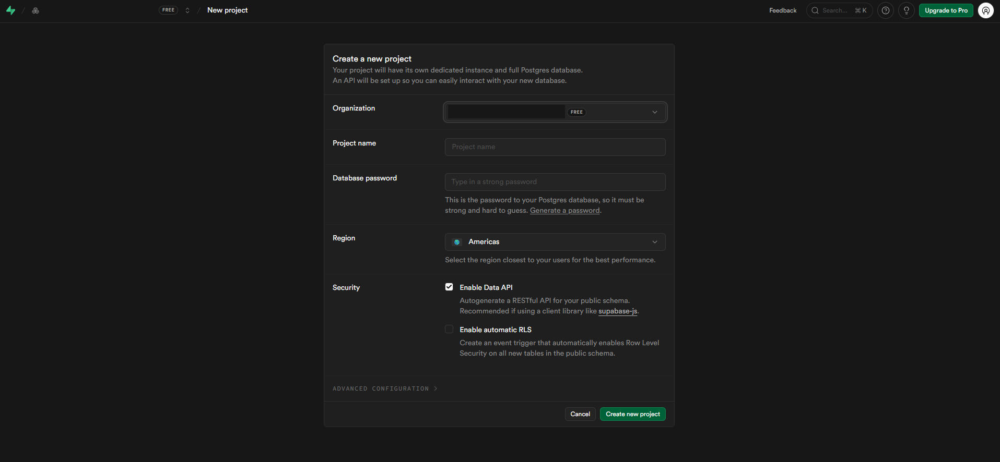

# Guía: Configuración de Base de Datos Espacial en Supabase

[« Volver al Índice](./README.md) | [Siguiente Paso: Activación de PostGIS »](./02-activacion-postgis.md)

---

Esta guía detalla los pasos para crear y configurar una instancia de **PostgreSQL** en la nube utilizando **Supabase**, permitiendo que tu información espacial sea accesible globalmente.

## 1. Introducción

Para que un geoportal funcione de manera colaborativa, necesitamos un hosting que soporte **PostgreSQL**. Supabase ofrece un plan gratuito ideal para proyectos de aprendizaje y prototipado rápido de información geográfica.

## 2. Registro y Verificación

1. Accede al sitio oficial: [supabase.com](https://supabase.com).
2. Haz clic en **Sign Up** o **Login**.
3. Regístrate con tu correo electrónico.
4. **Crítico:** Revisa tu bandeja de entrada y confirma tu correo haciendo clic en el enlace de **Confirm email address**.

## 3. Configuración de la Organización

Tras verificar tu cuenta, el sistema te pedirá crear una organización:

- **Nombre:** Elige un nombre representativo (ej. `Proyecto Geoportal`).
- **Tipo:** Selecciona `Personal`.
- **Plan:** Elige el **Plan Gratuito (Free)**.

_Figura 1: Interfaz de creación de proyecto en Supabase._

> [!WARNING]

> En el plan gratuito, si la base de datos no tiene actividad durante **7 días**, Supabase la pausará. Deberás entrar al panel para reactivarla manualmente.

## 4. Creación del Proyecto

Configura los detalles técnicos de tu base de datos:

1. **Nombre del Proyecto:** Por ejemplo, `Geoportal`.
2. **Contraseña de la Base de Datos:**
   - **Importante:** Asígna una contraseña robusta y **guárdala inmediatamente**. La necesitarás para conectar QGIS y pgAdmin.
3. **Región:** Selecciona el servidor más cercano a tu ubicación para reducir la latencia (ej. `South America (São Paulo)` o `East US`).
4. Haz clic en **Create new project**.

---

### Resultado Esperado

Una vez finalizado el aprovisionamiento (puede tardar un minuto), tendrás una instancia de PostgreSQL lista para recibir extensiones espaciales.
