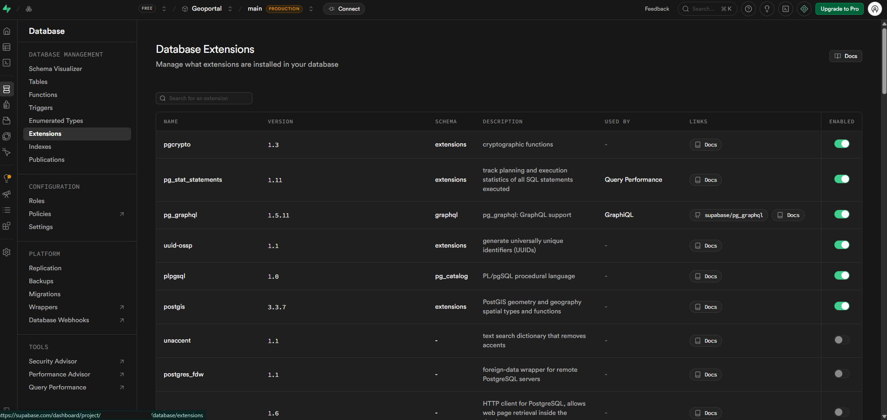

# 🗺️ Guía: Activación de PostGIS en Supabase

[« Volver al Índice](./README.md) | [Paso Anterior](./01-configuracion-supabase.md) | [Siguiente Paso: Obtención de Credenciales »](./03-obtencion-credenciales.md)

---

El paso más crítico para convertir **PostgreSQL** en una base de datos espacial es habilitar la extensión **PostGIS**.

## 1. Acceso al Panel de Base de Datos

_Figura 1: Panel lateral izquierdo._

1. En el panel lateral izquierdo de tu proyecto en Supabase, haz clic en el icono de **Database** 🐘.

## 2. Gestión de Extensiones

_Figura 1: Extensiones de Supabase._

1. Dentro de la configuración de la base de datos, selecciona la opción **Extensions**.
2. Verás una lista extensa de funcionalidades adicionales que puedes "encender" para tu servidor.

## 3. Habilitar PostGIS

1. Usa la barra de búsqueda y escribe: `PostGIS`.
2. Localiza la extensión **PostGIS** (normalmente versión 3.x).
3. Haz clic en el interruptor para **Enable extension**.

> [!NOTE]
> Al activar PostGIS, se crean automáticamente tablas de sistema como `spatial_ref_sys`, las cuales almacenan los códigos de sistemas de referencia (EPSG). **No borres estas tablas.**

## 4. Extensiones Adicionales (Opcional)

Si tu proyecto escala, considera activar:

- **PostGIS Raster:** Para trabajar con imágenes satelitales o modelos digitales de elevación.
- **pgRouting:** Ideal para calcular rutas óptimas y análisis de redes de transporte.

---

### Resultado Esperado

Tu base de datos ahora es espacial. Puede reconocer tipos de datos como `GEOMETRY` y `GEOGRAPHY`, y responder a consultas espaciales (ej. _¿Qué puntos están dentro de este polígono?_).
